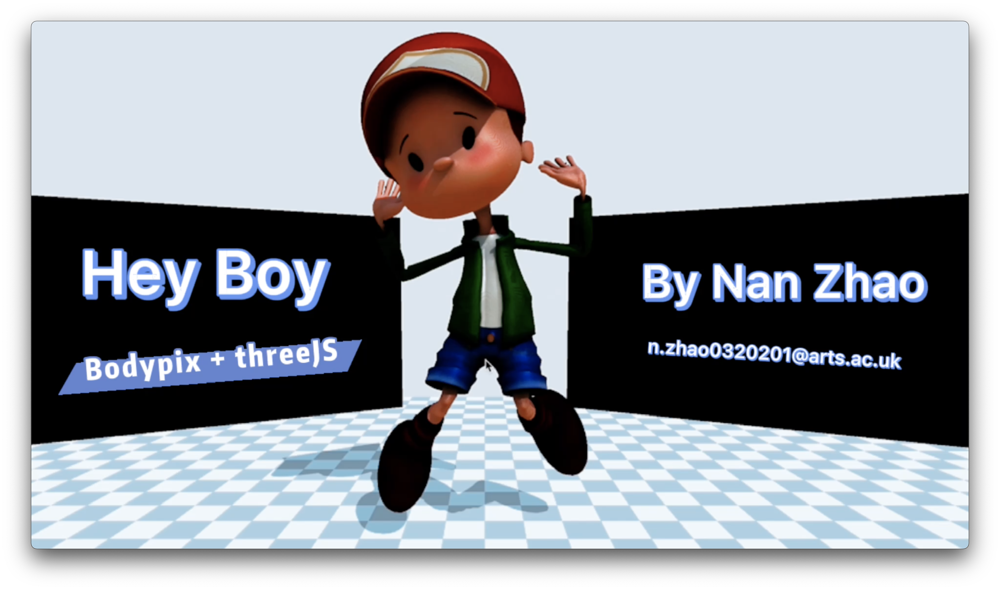
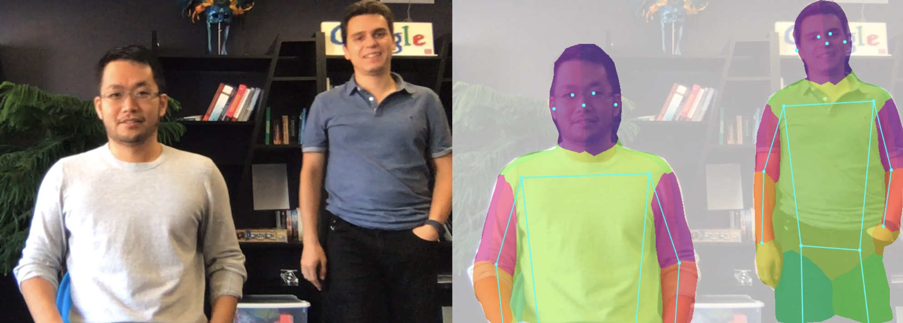
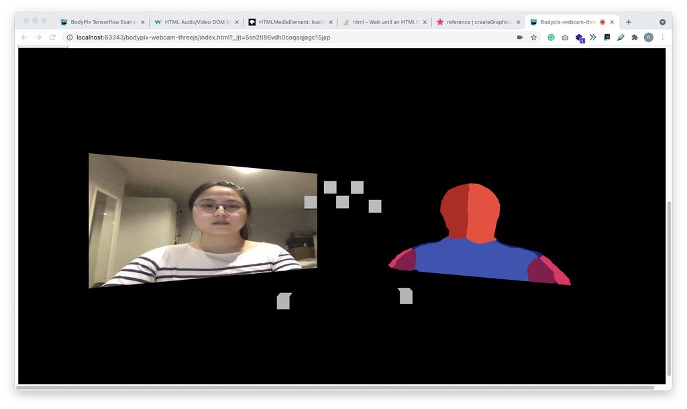
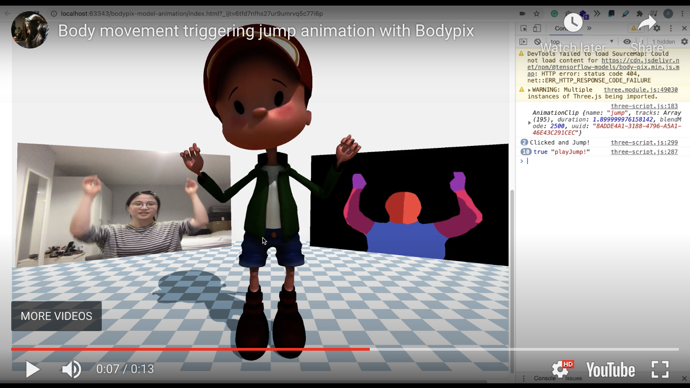
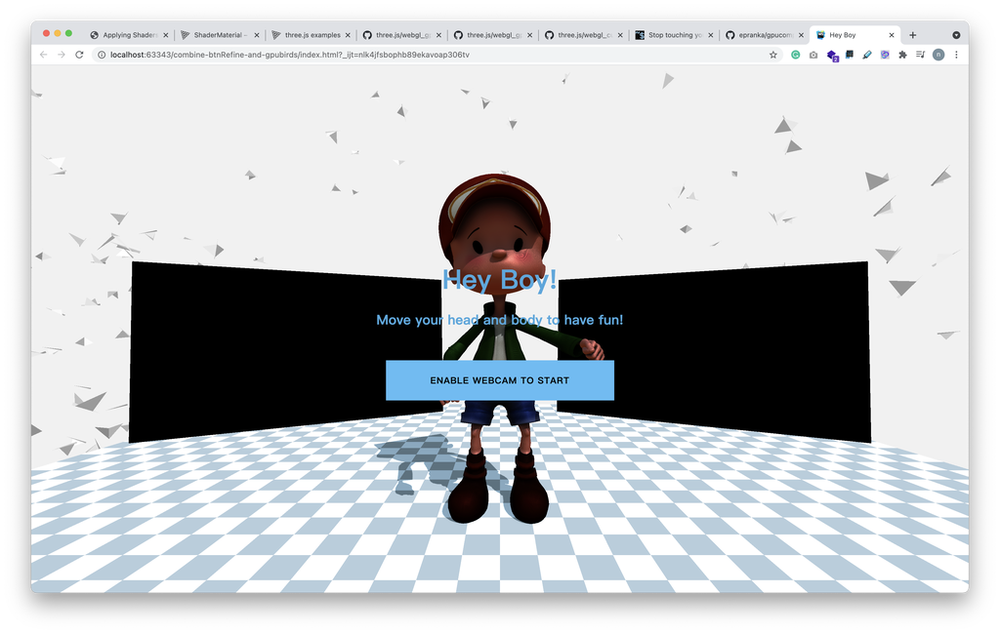

# Hey Boy | Bodypix and ThreeJS

## Introduction

**Hey Boy** is a web-based interaction experience. After clicking the button, you can rotate the boy's head by rotating your own head. You can also make the boy jump if you have an exciting pose of raising you arms. 

Bodypix model is used to sense the poses and body parts' positions. ThreeJS is used to build the whole environment and the experience.

The project is located in the directory called"hey-boy", while other tryouts and processes are in the "process" directory. Two demo videos are in the "demo-video".

<iframe width="739" height="416" src="https://www.youtube.com/embed/9jDNxHdfbvQ" title="YouTube video player" frameborder="0" allow="accelerometer; autoplay; clipboard-write; encrypted-media; gyroscope; picture-in-picture" allowfullscreen></iframe>

**Keywords**: #bodypix-model, #tensorflow.js, #three.js, #body-interaction

## Documentations

I logged the ideation and development process on my blog. It includes the following parts:

1. **[Ideation] Research 1-1st stage, 2nd stage, 3rd stage, and project proposal**: [link](https://nanzhaodocumentations.wordpress.com/2021/03/27/coding2-final-progress-research-1/)

   - Notice that the final project is not as same as the initial project proposal. But through all the development posts, you could see how I built the experience and changed my own ideas while balancing technologies and techniques.

2. **[Research] Inspiring Visual Effects & Interactions**: [link](https://nanzhaodocumentations.wordpress.com/2021/03/30/coding2-final-progress-inspiring-visual-effects-interactions/)

   - The inspirations contain two directions. One is create visual effects based on the body ( which needs normal information), and the other is build connection between body poses and a 3D character. I chose the latter one. More in the blog.
   - 

3. **[Tech Research] Research 2 Tech Details**: [link](https://nanzhaodocumentations.wordpress.com/2021/03/31/coding2-final-progress-research-2-tech-details/)

   - In this research status, I studied and looked into different possible tech solutions.

4. **[Development] Development 1 – threeJS vs p5shader vs ml5**: [link](https://nanzhaodocumentations.wordpress.com/2021/04/02/coding2-final-progress-development-1-threejs-vs-p5shader-vs-ml5/)

   - After trying the three methods, I chose just use threeJS without bring more libraries. More tryout results and thinkgings are in the blog.

   - <iframe width="740" height="416" src="https://www.youtube.com/embed/7fX1Xmwm2ns" title="YouTube video player" frameborder="0" allow="accelerometer; autoplay; clipboard-write; encrypted-media; gyroscope; picture-in-picture" allowfullscreen></iframe>

5. **[Development] Development 2 – recreate bodypix in threeJS renderer:** [link](https://nanzhaodocumentations.wordpress.com/2021/04/04/coding2-final-progress-development-2-recreate-bodypix-in-threejs-renderer/)

   - 

6. **[Development] Development 3 – Possible Interactions & Model Animation in threejs**: [link](https://nanzhaodocumentations.wordpress.com/2021/04/06/coding2-final-progress-development-3-possible-interactions-model-animation-in-threejs/)

   - 

7. **[Development] Development 4 – Link my body with the boy model!** [link](https://nanzhaodocumentations.wordpress.com/2021/04/08/coding2-final-progress-development-4-link-my-body-with-the-boy-model/)

   - 

8. **[Development] Development 5 – Finalize the project, GPU Renderer and Next Step: **[link](https://nanzhaodocumentations.wordpress.com/2021/04/13/coding2-final-progress-development-5-finalize-the-project-gpu-renderer-and-next-step/)

   - I cleaned up the code, refined the user interface via CSS

   - I learned and built explosion effect on GPU Computation Rendered Particles, by writing position, velocity information into textures and modify the effect with Uniforms.

   - I tried to embedded the particles/birds into the project.(Failed) And frame the next step of the project

   - - 

     

## Thank you and Have fun!

